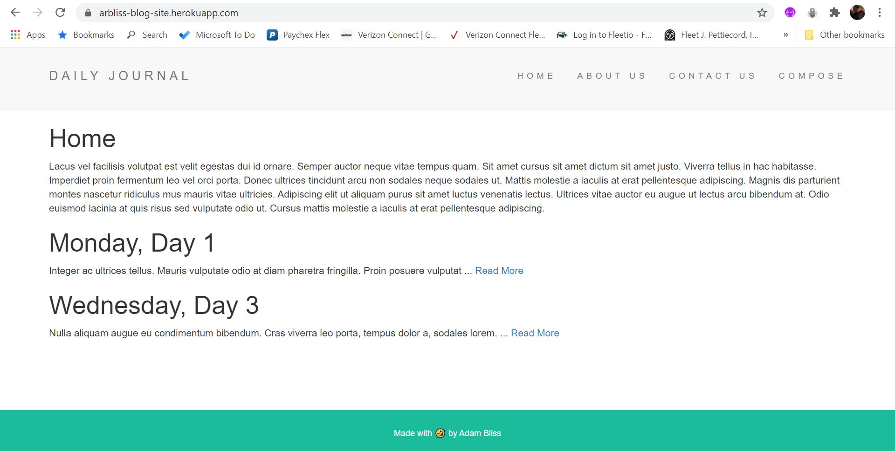
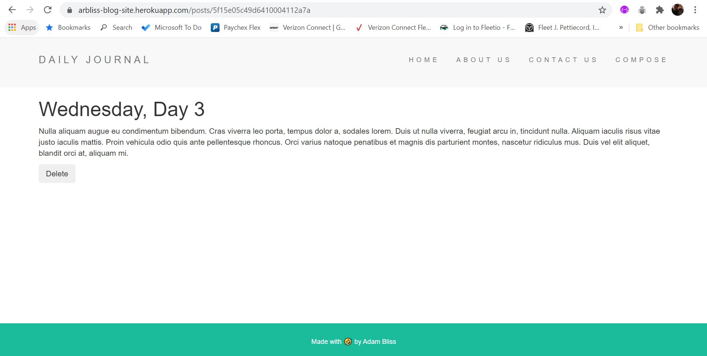

# EJS Blog with Mongo database
This is a sample blog site I built using HTML, CSS, Javascript, Node.js, Express and Mongo

## General info
This project was for learning to add a mongoDB backend to persist the data, versus the previous version which just used variables that would reset when the server did.

## Screenshots
DEMO: https://arbliss-blog-site.herokuapp.com/




## Technologies
* Node.js
* mongoDB
* Express
* EJS
* HTML/CSS/Javascript

## Setup
run mongodb server (local or cloud)
node app.js

## Code Examples

```Javascript
app.get("/posts/:postId", function(req, res){
  const requestedPostId = req.params.postId;

  Post.findOne({_id: requestedPostId}, function(err, post){
    if (!err) {
      res.render("post", {
      title: post.title,
      content: post.content,
      postId: requestedPostId
      });
    }
  });
});
```

## Features
List of features ready and TODOs for future development
* Can add and delete blog posts from database
* Dynamic routes that display created posts

To-do list:
* Add user authentication
* Store blog posts by user

## Status
Project is: _finished_

## Inspiration
Project inspired by a STRONG desire to learn!

## Contact
Created by https://www.linkedin.com/in/adam-bliss-50951321/ - feel free to contact me!
